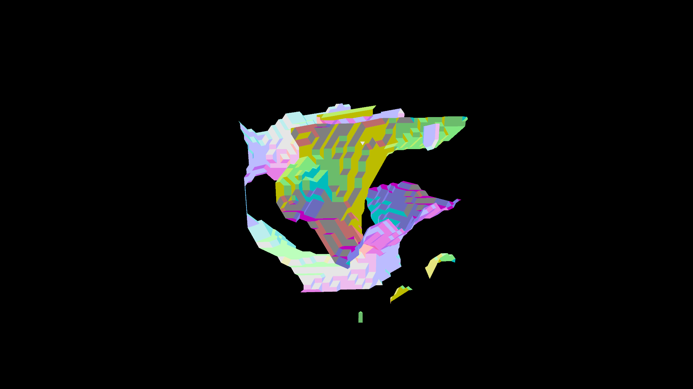

# Guacamole

Marching cubes from Perlin noise implemented in compute shader.

## Description

Worker thread launches a compute shader that uses 3D Perlin noise to generate iso surface data that is triangulated using marching cubes.
This triangulation is packed ("optimized") by short lived threads.
Once the packing is done the triangulation is uploaded as a vertex buffer and treated as a "chunk".

Each available chunk is then rendered in turn.

## Progress Screenshot

## TODO
- ✅ Marching cubes compute shader
- ✅ Threaded geometry generation
- ✅ Frame timing output
- ✅ Fix crash that occurs after ~100 chunks (this is probably an out of memory error)
- ✅ Improve frame times during chunk generation
- ✅ Improve pack times, right now it is a very dumb linear scan.
- ✅ Implement some form of culling, currently FPS decreases with each chunk generated
- ✅ Improve culling, currently only culled on X-axis and Z-axis.
- 🔲 Improve culling, currently kinda jank.
- 🔲 Add a max draw distance, chunks very far away probably aren't adding much.
- 🔲 Performance counters on GPU to get better perf data
- 🔲 Use a thread pool for the short lived threads to cut down on overhead.
- 🔲 Smooth out marching cubes by properly interpolating instead of just taking the halfway point.
- 🔲 Use `meshoptimizer` to further optimize meshes.
- 🔲 Smooth out marching cubes by calculating smoothed normals.
- 🔲 Vectorize parts we can.
- 🔲 Allow "infinite" world growth.

## Dev Log

### 2021-05-16
Added some more basic frustum culling.
Through experimenting with this it became obvious that frame rate spikes are due concurrent compute shader and GFX load.
If the number of vertices being rendered is kept constant through culling, the frame times don't exceed 16ms even when computing new geometry.
Frame rates never dip below 8ms for some reason though, likely related to `vkQueueWaitIdle` or something else to do with the swap chain.

## Discussion

Vulkan does not allow separate threads to access certain objects.
One of these is the `VkDeviceQueue` that is used to submit compute commands.
A worker thread owns this queue and so it is the only thread that is allowed to submit compute commands.

The main thread communicates with this worker queue by pushing work items onto a queue.
Pushing onto / popping off the queue is protected by a simple mutex.
Lockfree algorithms are not necessary here since work items are submitted relatively infrequently.

A semaphore controls execution of the worker thread.
Each time an item is pushed onto the queue, the semaphore is incremented.
Each time an item is popped off the queue, the semaphore is decremented.
If the semaphore is 0, the worker thread is suspended.
This prevents it from spinning.

The worker thread spawns additional threads to perform mesh optimizations on the result of the triangulation received from the compute shader.
These threads work on memory that is completely independent of every other thread, so they don't need any synchronization.
