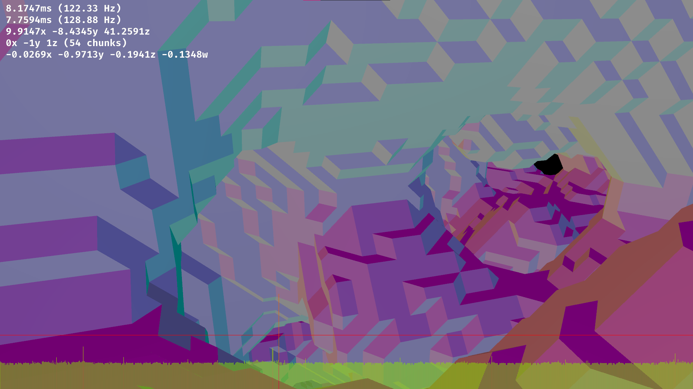

# Guacamole

Marching cubes from Perlin noise implemented in compute shader.

## Description

Worker thread launches a compute shader that uses 3D perlin noise to generate iso surface data that is triangulated using marching cubes.
This triangulation is packed ("optimized") by short lived threads.
Once the packing is done the triangulation is uploaded as a vertex buffer and treated as a "chunk".

Each available chunk is then rendered in turn.

## Progress Screenshot

## TODO
- ✅ Marching cubes compute shader
- ✅ Threaded geometry generation
- ✅ Frame timing output
- 🔲 Fix crash that occurs after ~100 chunks (this is probably an out of memory error)
- 🔲 Implement some form of culling, currently FPS decreases with each chunk generated
- 🔲 Improve frame times during chunk generation

## Discussion

Vulkan does not allow separate threads to access certain objects.
One of these is the `VkDeviceQueue` that is used to submit compute commands.
A worker thread owns this queue and so it is the only thread that is allowed to submit compute commands.

The main thread communicates with this worker queue by pushing work items onto a queue.
Pushing onto / popping off the queue is protected by a simple mutex.
Lockfree algorithms are not necessary here since work items are submitted relatively infrequently.

A semaphore controls execution of the worker thread.
Each time an item is pushed onto the queue, the semaphore is incremented.
Each time an item is popped off the queue, the semaphore is decremented.
If the semaphore is 0, the worker thread is suspended.
This prevents it from spinning.

The worker thread spawns additional threads to perform mesh optimizations on the result of the triangulation received from the compute shader.
These threads work on memory that is completely independent of every other thread, so they don't need any synchronization.
